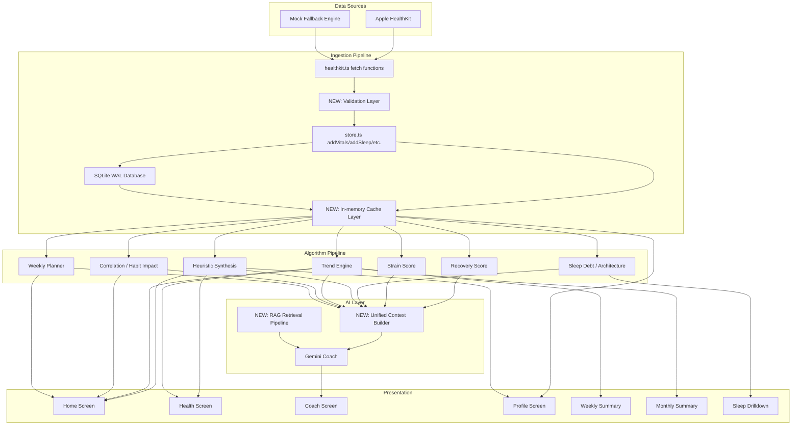

# Elite Health — Bug Fixes & Improvements Plan

## Architecture Overview

---

## Phase 1: Backend ETL Pipeline Overhaul — "Clean Data First"

### 1.1 Add Validation Layer to healthkit.ts
**File**: [`elite-health/src/lib/healthkit.ts`](elite-health/src/lib/healthkit.ts)
**Problem**: When HealthKit returns zero samples, `fetchVitalsForDate` returns `{hrv:0, rhr:0, spo2:0, respiratoryRate:0, skinTempDelta:0}`. These zeros flow through the entire pipeline and display as "oxygen 1%, breathing 0.0/min, skin temp 0.0°C".

**Actions**:
- After each fetch function (`fetchVitalsForDate`, `fetchSleepForDate`, `fetchActivitiesForDate`, `fetchMobilityForDate`, `fetchEnvironmentalForDate`, `fetchCardioMetabolicForDate`), run results through a validator that returns `null` for any date where data is all-zero or clearly invalid.
- For `fetchVitalsForDate`: HRV must be > 0, RHR must be ≥ 30 and ≤ 200, SpO2 must be ≥ 80, respiratory rate must be ≥ 4 and ≤ 40, skin temp delta must be between -3 and +3. If ALL are zero/invalid, return `null`.
- For `fetchSleepForDate`: totalDurationMins must be > 60 (at least 1 hour). If 0, return `null`.
- For `fetchMobilityForDate`: doubleSupport must be > 0 to be valid.
- For `fetchEnvironmentalForDate`: timeInDaylight must be > 0 or headphoneAudio must be > 0.
- For `fetchCardioMetabolicForDate`: vo2Max must be > 0.
- Modify mock engine: when generating mock data, always produce plausible values (never zero for core metrics).

### 1.2 Guard store.ts Add Functions Against Invalid Data
**File**: [`elite-health/src/lib/store.ts`](elite-health/src/lib/store.ts)
**Problem**: `addVitals`, `addSleep`, etc. blindly insert any data passed to them, including zero-value records.

**Actions**:
- In `addVitals`: reject if `v.hrv === 0 && v.rhr === 0 && v.spo2 === 0` (all-core-zeros guard).
- In `addSleep`: reject if `record.totalDurationMins === 0`.
- In `addMobility`: reject if all mobility metrics are zero.
- In `addEnvironmental`: reject if all env metrics are zero.
- In `addCardioMetabolic`: reject if `record.vo2Max === 0`.
- In `addActivity`: reject if `record.hrZones.every(z => z === 0)`.

### 1.3 Fix syncHealthKit to Handle Null Returns
**File**: [`elite-health/src/lib/store.ts`](elite-health/src/lib/store.ts:314-373)
**Problem**: `syncHealthKit` iterates 14 days and calls add functions regardless of whether data is valid. Also `initialSyncDone` guard prevents re-sync.

**Actions**:
- Remove the `if (get().initialSyncDone) return` guard entirely. Always attempt sync.
- Instead, track `lastSyncTimestamp` per metric type and only refetch if last sync was > 30 minutes ago OR if date range isn't fully covered.
- When a fetch returns `null` for a date (no valid data), skip that date's `add*` call entirely — do not insert zeros.
- Add a sync queue so that if the user is viewing a past date and data is missing, trigger a targeted fetch for just that date.

### 1.4 Create a Unified Data Validation Utility
**New File**: `elite-health/src/lib/utils/validation.ts`
**Problem**: No reusable validation logic exists in the elite-health app.

**Actions**:
- Port and extend the Zod schemas from [`src/lib/utils/validation.ts`](src/lib/utils/validation.ts).
- Add: `isValidVitals(v)`, `isValidSleep(s)`, `isValidActivity(a)`, `isValidMobility(m)`, `isValidEnvironmental(e)`, `isValidCardioMetabolic(c)`.
- Add: `isValidRecoveryScore(n)` → must be 1-100.
- Add: `isValidStrainScore(n)` → must be 1-21.
- Add: `isPlausibleHRV(n)` → 10-250.
- Add: `isPlausibleRHR(n)` → 30-200.
- Add: `isPlausibleSpO2(n)` → 80-100.
- Add: `isPlausibleRespiratoryRate(n)` → 4-40.
- Add: `isPlausibleSkinTempDelta(n)` → -3 to +3.
- Export all validators for use across the app.

---

## Phase 2: Caching Layer + Skeleton Loading States

### 2.1 Create In-Memory Cache Manager
**New File**: `elite-health/src/lib/cache.ts`
**Problem**: Every page load triggers `loadFromDB()` + `syncHealthKit()`. No data is cached in memory, causing lag on navigation and restart.

**Actions**:
- Create a `DataCache` class with:
  - `vitalsCache: Map<string, VitalsRecord>` (keyed by date string)
  - `sleepCache: Map<string, SleepRecord>`
  - `scoresCache: Map<string, DailyScores>`
  - `synthesisCache: Map<string, SynthesisOutput>`
  - `weeklyPlanCache: { plan: WeeklyPlan | null, computedAt: number }`
  - `trendReportCache: { report: TrendReport | null, computedAt: number }`
  - `correlationInsightsCache: { insights: CorrelationInsight[], computedAt: number }`
- TTL-based invalidation: vitals/sleep/scores cached for 5 minutes; synthesis/trends/plans cached for 15 minutes.
- `invalidate(dateStr?)` method to clear specific or all cache entries.
- After `loadFromDB()` completes, pre-populate the cache from DB records.
- After `syncHealthKit()` completes, update cache with fresh records.

### 2.2 Add Skeleton Loading Components
**Files to create/modify**:
- **New**: `elite-health/src/components/ui/skeleton.tsx` — Reusable skeleton shimmer component (animated placeholder with pulse opacity).
- **Modify**: [`elite-health/app/(tabs)/index.tsx`](elite-health/app/(tabs)/index.tsx:166) — Show skeleton placeholders for: LongevitySphere, PerformanceRingRow, DailyDirective, WeeklyPlannerCard, DataGrid, CorrelationExplorer when `isLoading` is true.
- **Modify**: [`elite-health/app/(tabs)/health.tsx`](elite-health/app/(tabs)/health.tsx:618) — Show skeleton placeholders for pillar sections, vitals grid, biological age when loading.
- **Modify**: [`elite-health/src/components/home/weekly-planner-card.tsx`](elite-health/src/components/home/weekly-planner-card.tsx:242) — Already has skeleton state; ensure it fires during cache miss, not on every re-render.
- **Modify**: [`elite-health/app/drilldown/weekly-summary.tsx`](elite-health/app/drilldown/weekly-summary.tsx:470) — Add skeleton loading for sparklines, charts.
- **Modify**: [`elite-health/app/drilldown/monthly-summary.tsx`](elite-health/app/drilldown/monthly-summary.tsx:550) — Add skeleton loading for calendar heatmap, trend charts.

### 2.3 Add Loading State to Store
**File**: [`elite-health/src/lib/store.ts`](elite-health/src/lib/store.ts)
**Actions**:
- Add `isLoading: boolean` to HealthState.
- Set `isLoading: true` at the start of `loadFromDB` and `syncHealthKit`.
- Set `isLoading: false` after both complete (or after 10s timeout).
- Components check `useHealthStore(s => s.isLoading)` to show skeletons.

---

## Phase 3: Data Validation in UI (Display Guards)

### 3.1 Create Display-Safe Value Helpers
**New File**: `elite-health/src/lib/utils/display-helpers.ts`
**Actions**:
- `safeMetric(value: number, unit: string, min: number, max: number): string` — Returns formatted string or "--" if out of range.
- `safePercent(value: number): string` — Returns "XX%" or "--" if ≤ 0 or > 100.
- `safeHRV(value: number): string` — Returns HRV value or "--" if < 10 or > 250.
- `safeRHR(value: number): string` — Returns RHR value or "--" if < 30 or > 200.
- `safeSpO2(value: number): string` — Returns SpO2% or "--" if < 80 or > 100.
- `safeRecovery(value: number): string` — Returns recovery% or "--" if ≤ 0 or > 100.
- `safeStrain(value: number): string` — Returns strain score or "--" if ≤ 0 or > 21.
- `safePaceOfAging(value: number): string` — Returns "X.XX×" or "--" if ≤ 0 or > 3.
- `safeSkinTemp(value: number): string` — Returns "±X.X°C" or "--" if outside -3 to +3.
- `safeRespiratoryRate(value: number): string` — Returns breaths/min or "--" if < 4 or > 40.

### 3.2 Apply Display Guards Across All Components
**Files to modify** (systematic audit):

| Component | Metric | Guard |
|-----------|--------|-------|
| [`health.tsx` Recovery section](elite-health/app/(tabs)/health.tsx:134) | spo2, respiratoryRate, skinTempDelta | `safeSpO2`, `safeRespiratoryRate`, `safeSkinTemp` |
| [`health.tsx` Resilience section](elite-health/app/(tabs)/health.tsx:226) | injuryRisk, cnsStress, audioLevel | `safeMetric` with appropriate ranges |
| [`health.tsx` Longevity section](elite-health/app/(tabs)/health.tsx:385) | vo2Max, doubleSupport, paceOfAging | `safeMetric`, `safePaceOfAging` |
| [`vitals-rings.tsx` Recovery ring](elite-health/src/components/home/vitals-rings.tsx:26) | recoveryScore | `safeRecovery` |
| [`vitals-rings.tsx` Strain ring](elite-health/src/components/home/vitals-rings.tsx:39) | strainScore | `safeStrain` |
| [`vitals-rings.tsx` Sleep ring](elite-health/src/components/home/vitals-rings.tsx:52) | sleepScore | `safeRecovery` |
| [`data-grid.tsx` Health Check](elite-health/src/components/home/data-grid.tsx:66) | metricsInRange | Ensure derived from valid data |
| [`data-grid.tsx` Body Stress](elite-health/src/components/home/data-grid.tsx:83) | paceOfAging | `safePaceOfAging` (don't show 0.00×) |
| [`daily-directive-v2.tsx`](elite-health/src/components/home/daily-directive-v2.tsx:47) | readiness/resilience/longevity scores | `safeRecovery` for each pillar |
| [`weekly-planner-card.tsx`](elite-health/src/components/home/weekly-planner-card.tsx:227) | projectedOutcomes | Guard all projected scores |
| [`sleep-drilldown.tsx`](elite-health/src/components/home/sleep-drilldown.tsx:11) | sleep stages, efficiency | Guard against 0-min sleep |
| [`longevity-sphere.tsx`](elite-health/src/components/home/longevity-sphere.tsx:135) | paceOfAging | Don't show 0.00× on sphere |
| [`weekly-summary.tsx`](elite-health/app/drilldown/weekly-summary.tsx:352) | All sparkline values | Filter zero values from sparklines |
| [`monthly-summary.tsx`](elite-health/app/drilldown/monthly-summary.tsx:477) | Calendar heatmap, vo2max | Filter zero scores from heatmap |
| [`sleep.tsx` drilldown](elite-health/app/drilldown/sleep.tsx:9) | Sleep architecture | Guard if no sleep data |
| [`coach.tsx` biometric context](elite-health/app/(tabs)/coach.tsx:69) | All snapshot values | Strip zeros before sending to Gemini |
| [`profile.tsx`](elite-health/app/(tabs)/profile.tsx:17) | Records, stats | Guard all displayed metrics |

---

## Phase 4: UI Fixes

### 4.1 Fix Correlation Explorer — Black Text on Black Background
**File**: [`elite-health/src/components/home/correlation-explorer.tsx`](elite-health/src/components/home/correlation-explorer.tsx)
**Problem**: The "Link" (r), "Certainty" (r²), and "Days" (n) statistics may render with dark text on the dark GlassCard background.

**Actions**:
- At lines 128-136, the `<Text>` elements showing `r.toFixed(2)`, `r2.toFixed(2)`, and `observations` need explicit light text colors.
- Change all stat value `<Text>` elements to use `className="text-ice text-small font-bold"` (or equivalent light color).
- The label Text elements (e.g., "Link", "Certainty", "Days") should use `className="text-steel text-micro"`.
- At the category filter tags (lines 57-68), ensure text inside filter pills has proper contrast.

### 4.2 Make Correlation Explorer Human-Readable
**File**: [`elite-health/src/components/home/correlation-explorer.tsx`](elite-health/src/components/home/correlation-explorer.tsx)
**Problem**: Users see "r=0.67, r²=0.45, n=14" which means nothing to them.

**Actions**:
- Replace the raw r, r², n display with human-readable interpretation:
  - Instead of "Link: 0.67" → Show "Strong link" (for |r| ≥ 0.7), "Moderate link" (0.4-0.69), "Weak link" (0.2-0.39), "No clear link" (< 0.2).
  - Instead of "Certainty: 0.45" → Show "45% explained" (r² × 100 as percentage).
  - Instead of "Days: 14" → Show "Over 14 days".
- Use the already-computed `significance` field from `CorrelationResult` for the link strength label.
- Add a plain-language summary line: e.g., "Morning sunlight is strongly linked to higher HRV."

### 4.3 Fix LongevitySphere — Text Should Not Rotate
**File**: [`elite-health/src/components/home/longevity-sphere.tsx`](elite-health/src/components/home/longevity-sphere.tsx:324-465)
**Problem**: The pace-of-aging multiplier text and status label are children of `Animated.View style={sphereStyle}` which includes rotation transform. The text rotates with the sphere.

**Actions**:
- Move the `View` containing `<Text>` elements (lines 426-464) OUTSIDE the `Animated.View` with `sphereStyle`.
- Place the text labels in a separate absolutely-positioned `View` that overlays the sphere but does NOT have the rotation animation applied.
- The SVG sphere itself continues to rotate; only the labels remain static.

### 4.4 Create Creative Math-Based 3D Sphere (No Text on Surface)
**File**: [`elite-health/src/components/home/longevity-sphere.tsx`](elite-health/src/components/home/longevity-sphere.tsx)
**Problem**: Current sphere is a static gradient circle with rotating particles. Not visually impressive enough.

**Actions**:
- Implement **Lissajous curve rings** orbiting the sphere at different tilts — each ring is a parametric equation: `x(t) = A·sin(a·t + δ)`, `y(t) = B·sin(b·t)` mapped onto an ellipse rotated at different angles.
- Add **waveform surface distortion**: Use multiple overlaid sine waves on the sphere's edge to simulate dynamic surface displacement (like a breathing cell).
- **Equation-driven glow**: The glow intensity = `sin(paceOfAging * π) * cos(recoveryScore/100 * π/2)` — tying the visual directly to biometric equations.
- **Fibonacci spiral particle distribution**: Instead of random particles, distribute them on a Fibonacci sphere for even coverage, then animate them along great-circle arcs.
- **Color palette driven by recovery zone**: Green zone → emerald/teal gradients, Yellow zone → amber/gold, Red zone → crimson/magenta.
- All animations use `withTiming` and `withRepeat` from Reanimated, not JS-driven intervals.
- Display the pace-of-aging value and label as a clean HUD overlay (static, not rotating) below the sphere.

### 4.5 Remove Transparent "Ask Coach" Section from Home
**File**: [`elite-health/src/components/home/ai-prompt-bar.tsx`](elite-health/src/components/home/ai-prompt-bar.tsx)
**Problem**: The `AIPromptBar` at the bottom of the home screen has a transparent/glass background that looks awkward.

**Actions**:
- Change the container `View` (line 32) from glass/transparent styling to a solid background: `className="bg-obsidian-900 border-t border-border-dim"`.
- Or, if the user prefers, make it a floating pill button instead of a full-width bar: a compact rounded pill that says "Ask Coach" which expands on press.
- Clarify with user which approach they prefer.

---

## Phase 5: Cross-Page Data Consistency

### 5.1 Create a Shared Data Provider / Context
**File**: [`elite-health/src/lib/store.ts`](elite-health/src/lib/store.ts)
**Problem**: Home, Health, Coach, and Profile pages each independently load data. Past-day views show less data because historical data may not be synced.

**Actions**:
- Add a `selectedDate: string` field to HealthState (defaults to today).
- Ensure `loadFromDB()` loads ALL available dates from SQLite (not limited to today).
- Ensure `syncHealthKit()` fetches a rolling 30-day window (up from 14) so past-day views have sufficient data.
- Add `getScoresForDate(dateStr)` and `getVitalsForDate(dateStr)` selectors that fall back to the nearest available date if exact match is missing.
- Standardize the "current date" concept: all pages read `selectedDate` from the store, and date-shifting (left/right arrows) updates this single source of truth.
- Ensure the Coach screen's `buildBiometricsContext` uses the same selectedDate as the rest of the app.

### 5.2 Standardize Biometric Context for Coach
**File**: [`elite-health/app/(tabs)/coach.tsx`](elite-health/app/(tabs)/coach.tsx:69-139)
**Problem**: Coach context is built ad-hoc and may include zero values.

**Actions**:
- Use `safeRecovery`, `safeHRV`, `safeRHR`, etc. from display-helpers when building context.
- Strip any field with value 0 or null before sending to Gemini.
- Include trend data from `computeTrendReportSelector` for richer context.
- Include correlation insights for personalized recommendations.

---

## Phase 6: RAG Integration for Coach

### 6.1 Wire RAG Pipeline into Coach
**Files to modify**: [`elite-health/app/(tabs)/coach.tsx`](elite-health/app/(tabs)/coach.tsx), [`elite-health/src/lib/gemini/client.ts`](elite-health/src/lib/gemini/client.ts)
**New File**: `elite-health/src/lib/rag/coach-rag.ts`

**Actions**:
- Create a RAG orchestrator that:
  1. Takes the user's query.
  2. Calls `retrieveRelevantChunks` from [`src/lib/rag/retrieval.ts`](src/lib/rag/retrieval.ts) to find relevant health knowledge from stored documents.
  3. Retrieves the user's biometric context (filtered of zeros).
  4. Assembles a prompt: system prompt + retrieved RAG context + user biometrics + user query.
  5. Sends to Gemini.
- Store static health reference documents in `data/documents/` (if not already present).
- Index documents on app startup using the existing chunker + embeddings + vector store from `src/lib/rag/`.
- Add a `useRag: boolean` option to `sendCoachMessage` in [`client.ts`](elite-health/src/lib/gemini/client.ts).

### 6.2 Populate RAG Document Store
**Actions**:
- Add curated health/recovery/training knowledge documents to `data/documents/`.
- On app init, run the chunker (from [`src/lib/rag/chunker.ts`](src/lib/rag/chunker.ts)) and embedder (from [`src/lib/rag/embeddings.ts`](src/lib/rag/embeddings.ts)) to build the vector store.
- Cache the vector store to avoid re-indexing on every launch.

---

## Phase 7: Complete Audit — Every Feature, Every Chart

### 7.1 Home Screen Audit Checklist
 **File**: [`elite-health/app/(tabs)/index.tsx`](elite-health/app/(tabs)/index.tsx)

| Component | Check |
|-----------|-------|
| LongevitySphere | Pace of aging > 0, no 0.00×, animation works, text static |
| PerformanceRingRow (Recovery) | Score 1-100, color matches zone, shows "--" if invalid |
| PerformanceRingRow (Strain) | Score 1-21, color matches zone |
| PerformanceRingRow (Sleep) | Score derived from actual sleep data, not placeholder |
| DailyDirectiveV2 | All three pillar scores are valid integers, directive text is non-empty |
| WeeklyPlannerCard | Plan loads from cache, no lag, projected outcomes are plausible |
| DataGrid (Health Check) | metricsInRange reflects actual vitals validation |
| DataGrid (Body Stress) | paceOfAging > 0, biological age > 0 |
| ActivityTimeline | Shows real activities, not mock when HealthKit is available |
| CorrelationExplorer | Text is light on dark, stats are human-readable |
| InterceptModal | Triggers are based on real data, not phantom alerts |
| AIPromptBar | Solid background, not transparent |
| Past-day view (non-today) | Shows historical data, not blank/empty |

### 7.2 Health Screen Audit Checklist
 **File**: [`elite-health/app/(tabs)/health.tsx`](elite-health/app/(tabs)/health.tsx)

| Section | Check |
|---------|-------|
| ReadinessSection | HRV, RHR, SpO2, respiratory rate, skin temp all validated |
| ResilienceSection | Injury risk (with mobility data), CNS stress, audio, daylight all validated |
| LongevitySection | VO2 Max, double support, pace of aging all validated |
| BiologicalAge | Age delta computed correctly, not showing 0 |
| Strain card | Strain score 1-21, HR zones populated |
| VitalsGrid | Shows "--" for any invalid metric |
| Focus sections (readiness/resilience/longevity) | Data matches what's on Home screen |
| Past-day navigation | Historical data displays correctly |

### 7.3 Coach Screen Audit Checklist
 **File**: [`elite-health/app/(tabs)/coach.tsx`](elite-health/app/(tabs)/coach.tsx)

| Check |
|-------|
| Biometric context sent to Gemini has no zero values |
| Responses are relevant and reference actual user data |
| RAG context augments responses with factual health knowledge |
| Quick suggestions are contextual to current state |

### 7.4 Profile Screen Audit Checklist
 **File**: [`elite-health/app/(tabs)/profile.tsx`](elite-health/app/(tabs)/profile.tsx)

| Check |
|-------|
| Records display actual data counts, not zeros |
| Activity summary uses real activity data |
| Strain/recovery chart uses validated scores |
| Export tools export clean, validated data |

### 7.5 Drilldown Screens Audit Checklist

| Screen | Check |
|--------|-------|
| Weekly Summary | All sparklines filter out zero values, strain bars use valid scores, sleep phases show real data, CNS/daylight chart uses validated env data |
| Monthly Summary | Calendar heatmap excludes zero-score days, VO2Max trend excludes zeros, bio age delta is computed correctly, habit adherence reflects actual journal entries |
| Sleep Drilldown | Sleep architecture shows valid stages, history excludes zero-duration nights |

---

## Phase 8: Performance Optimization

### 8.1 Memoize Weekly Planner
**File**: [`elite-health/src/lib/algorithms/weekly-planner.ts`](elite-health/src/lib/algorithms/weekly-planner.ts:379)
**Actions**:
- Cache the `WeeklyPlan` result in the store's cache layer.
- Only recompute when underlying scores change.
- Use `useMemo` with proper dependency arrays in the component.

### 8.2 Optimize Store Selectors
**File**: [`elite-health/src/lib/store.ts`](elite-health/src/lib/store.ts)
**Actions**:
- `computeSynthesis`, `computeTrendReportSelector`, `computeCorrelationInsightsSelector` — all derived selectors should memoize their results based on input state.
- Create a `derivedCache` map in the store that invalidates when source data changes.

### 8.3 Reduce Re-renders
**Actions**:
- Use granular Zustand selectors throughout (e.g., `useHealthStore(s => s.vitals)` instead of `useHealthStore()`).
- Wrap expensive components in `React.memo`.
- Ensure `loadFromDB` doesn't trigger unnecessary state updates for unchanged data.

---

## Implementation Order

| # | Phase | Priority | Depends On |
|---|-------|----------|------------|
| 1 | 1.1 — Validation in healthkit.ts | **Critical** | None |
| 2 | 1.2 — Guard store.ts add functions | **Critical** | None |
| 3 | 1.4 — Create validation utility | **Critical** | None |
| 4 | 1.3 — Fix syncHealthKit null handling | **Critical** | 1.1, 1.2 |
| 5 | 3.1 — Display-safe value helpers | **High** | 1.4 |
| 6 | 3.2 — Apply display guards everywhere | **High** | 3.1 |
| 7 | 2.1 — Cache manager | **High** | 1.3 |
| 8 | 2.3 — Loading state in store | **High** | 2.1 |
| 9 | 2.2 — Skeleton loading components | **Medium** | 2.3 |
| 10 | 4.1 — Fix correlation explorer text colors | **Medium** | None |
| 11 | 4.2 — Human-readable correlation stats | **Medium** | None |
| 12 | 4.3 — Fix sphere text rotation | **Medium** | None |
| 13 | 4.4 — Creative math-based 3D sphere | **Medium** | None |
| 14 | 4.5 — Fix transparent AI bar | **Low** | None |
| 15 | 5.1 — Shared data provider consistency | **High** | 2.1 |
| 16 | 5.2 — Standardize coach biometric context | **High** | 3.1 |
| 17 | 6.1 — Wire RAG into coach | **Medium** | 5.2 |
| 18 | 6.2 — Populate RAG document store | **Medium** | 6.1 |
| 19 | 8.1 — Memoize weekly planner | **Medium** | 2.1 |
| 20 | 8.2 — Optimize store selectors | **Low** | None |
| 21 | 7.x — Complete audit pass | **Final** | All above |
