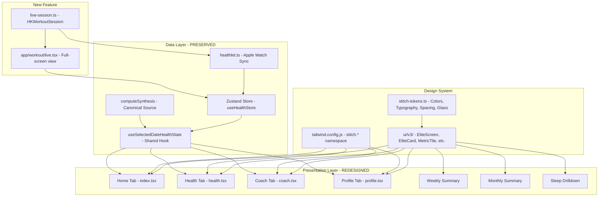

# Elite Health V3 — Stitch Visual Redesign & Live Workout Integration

## Scope Overview

This plan covers the complete UI/UX redesign of the Elite Health app to match the "Aura Kinetic" design system from the 12 Stitch reference screens, plus the integration of live Apple Watch workout tracking via HealthKit's `HKWorkoutSession` and `HKLiveWorkoutBuilder`. All existing data architecture, selected-date correctness, synthesis pipeline, and no-fake-fallback rendering rules are preserved.

---

## Phase 0: Design Token System & Reusable Component Library

### 0.1 Design Token Extraction

**New file**: `elite-health/src/theme/stitch-tokens.ts`

Extract the canonical Aura Kinetic design tokens from the 12 Stitch reference screens. All 12 screens share identical tokens, so there is a single source of truth:

```
{
  colors: {
    bg: '#000000',                  // OLED black background
    surface: '#131313',            // surface dim
    surfaceContainer: '#1f1f1f',   // standard glass card
    surfaceContainerHigh: '#2a2a2a',
    surfaceContainerHighest: '#353535',
    onSurface: '#e2e2e2',         // primary text
    onSurfaceVariant: '#bdc9c5',  // secondary text
    outline: '#879390',
    outlineVariant: '#3e4946',
    primary: '#ffffff',           // white text on dark
    primaryFixed: '#96f3e1',      // teal/cyan accent
    primaryFixedDim: '#7ad7c6',
    secondaryFixed: '#e5deff',    // purple accent
    secondaryFixedDim: '#c8c2e9',
    tertiaryFixed: '#bee9ff',     // cyan/blue accent
    tertiaryFixedDim: '#a1cde3',
    error: '#ffb4ab',
    errorContainer: '#93000a',
    glass: 'rgba(255,255,255,0.04)',
    border: 'rgba(255,255,255,0.08)',
    borderStrong: 'rgba(255,255,255,0.12)',
    // Pillar-specific colors
    pillarReadiness: '#14B8A6',
    pillarResilience: '#A855F7', 
    pillarLongevity: '#00E5FF',
    // Data colors
    success: '#30D158',
    warning: '#FFD60A',
    errorDisplay: '#FF453A',
    // Dim text
    dimText: 'rgba(255,255,255,0.40)',
    mutedText: 'rgba(255,255,255,0.55)',
  },
  typography: {
    displayLg: { fontFamily: 'Inter', fontSize: 48, fontWeight: '600', lineHeight: 1.1, letterSpacing: -0.04 },
    headlineLg: { fontFamily: 'Inter', fontSize: 32, fontWeight: '600', lineHeight: 1.2, letterSpacing: -0.02 },
    headlineLgMobile: { fontFamily: 'Inter', fontSize: 28, fontWeight: '600', lineHeight: 1.2 },
    headlineMd: { fontFamily: 'Inter', fontSize: 24, fontWeight: '500', lineHeight: 1.3 },
    bodyLg: { fontFamily: 'Inter', fontSize: 18, fontWeight: '400', lineHeight: 1.6 },
    bodyMd: { fontFamily: 'Inter', fontSize: 16, fontWeight: '400', lineHeight: 1.6 },
    metricXl: { fontFamily: 'Inter', fontSize: 56, fontWeight: '700', lineHeight: 1, letterSpacing: -0.05 },
    labelSm: { fontFamily: 'Inter', fontSize: 12, fontWeight: '500', lineHeight: 1.2, letterSpacing: 0.05 },
  },
  spacing: {
    unit: 4,
    containerPadding: 24,
    stackGap: 16,
    gridGutter: 12,
  },
  radius: {
    sm: 8,
    md: 12,
    lg: 16,
    xl: 20,
    full: 9999,
  },
  glass: {
    bg: 'rgba(255,255,255,0.04)',
    border: 'rgba(255,255,255,0.08)',
    borderStrong: 'rgba(255,255,255,0.12)',
    borderRadius: 12,
  },
}
```

This file becomes the **single import source** for all design constants. Replace all inline `STITCH`/`S` constant objects currently duplicated across ~8 files.

### 0.2 NativeWind Theme Extension

**Modify**: `elite-health/tailwind.config.js`

The existing `stitch.*` namespace in tailwind.config.js already captures most tokens. Align it with the extracted `stitch-tokens.ts` to ensure 1:1 parity. Add any missing tokens (e.g., `stitch.pillar-readiness`, `stitch.pillar-resilience`, `stitch.pillar-longevity`, `stitch.glass-*` borders).

### 0.3 Reusable UI Component Library

**New directory**: `elite-health/src/components/ui/v3/`

Create a comprehensive, reusable component library that every screen will consume:

| Component | Purpose | States |
|-----------|---------|--------|
| `EliteScreen` | Base screen wrapper with SafeAreaView + OLED bg + scroll | N/A |
| `EliteHeader` | Screen header with date selector arrows + synced indicator | Loading, synced, stale |
| `EliteCard` | Universal glass card wrapper (replaces ad-hoc GlassPanel) | Default, interactive (pressable) |
| `MetricTile` | Small metric display: value + label + status dot | Valid, insufficient, loading |
| `OrbMetricHero` | Large centered orb metric (used for primary pillar scores) | Valid, fallback, loading |
| `SphereMetricHero` | 3D procedural sphere (LongevitySphere base) | REVERSING, OPTIMAL, STEADY, ELEVATED, CRITICAL, fallback |
| `SectionHeader` | Standardized section label with optional info button | Default |
| `FocusBadge` | Pill-shaped focus indicator (already exists, standardize) | readiness, resilience, longevity |
| `StatusDot` | Small colored dot with optional glow | green, amber, red, unknown |
| `PillarRing` | SVG circle ring for pillar scores (refactor from PillarCard) | Valid score, insufficient ('--') |
| `VitalRow` | Horizontal vital display: value + unit + label | Valid, '--', loading |
| `Sparkline` | Mini SVG line/bar chart for trends | Data, no data |
| `TrendDelta` | Up/down arrow with value change | Positive, negative, neutral |
| `PillBadge` | Small pill label (e.g., "14d rolling") | Default |
| `GlassButton` | Interactive glass button with press animation | Default, disabled |
| `SkeletonTile` | Animated placeholder for loading states | Loading |
| `EmptyState` | "No data yet" placeholder | Empty |
| `ErrorState` | Error display with retry | Error |
| `LiveIndicator` | Pulsing green dot for live workout | Active, inactive |
| `ZoneBar` | Horizontal color-coded bar (strain, recovery zone) | Data, no data |

Each component:
- Accepts `testID` prop for E2E testing
- Uses `formatVital`/`safe*` helpers internally (never renders raw zeros)
- Follows the glass panel pattern: `backgroundColor: 'rgba(255,255,255,0.04)', borderWidth: 0.5, borderColor: 'rgba(255,255,255,0.08)', borderRadius: 12`

### 0.4 Remove Ad-Hoc GlassPanel Definitions

Currently, `GlassPanel` is redefined in 7+ files with slightly different tokens. Replace all inline `GlassPanel`/`STITCH`/`S` objects with imports from `stitch-tokens.ts` and the `v3/` component library.

**Files to deduplicate**:
- `app/(tabs)/index.tsx` — inline S token object
- `app/(tabs)/health.tsx` — inline STITCH token object + local GlassPanel
- `app/(tabs)/coach.tsx` — inline S token object + local GlassPanel
- `app/(tabs)/profile.tsx` — inline S token object + local GlassPanel
- `app/drilldown/weekly-summary.tsx` — inline S token object + local GlassPanel
- `app/drilldown/monthly-summary.tsx` — inline S token object + local GlassPanel
- `app/drilldown/sleep.tsx` — inline STITCH token object
- `src/components/profile/export-tools.tsx` — inline S token object + local GlassPanel
- `src/components/profile/records.tsx` — inline S token object + local GlassPanel

---

## Phase 1: Home Dashboard Redesign

**File**: `elite-health/app/(tabs)/index.tsx`

**Stitch reference**: `home-dashboard.html` (780×2968, "Home Dashboard Full High-Fidelity")

### 1.1 Header Section
- Clean "TODAY" header with `< >` date arrows
- Replace current ad-hoc date display with `EliteHeader` component
- Data freshness indicator (synced/loading/stale states)
- Profile avatar + notification bell (right side)

### 1.2 LongevitySphere Hero
- Keep existing `LongevitySphere` component as base
- Wrap in `OrbMetricHero` pattern with proper spacing
- Pace display: "0.82x REVERSING" format from Stitch
- Fallback state: when `isFallback=true`, show honesty overlay ("Insufficient biological data" per existing pattern)

### 1.3 Daily Directive
- Wrap in `EliteCard` with elevated glass styling
- Headline: "ALL SYSTEMS NOMINAL" (or synthesis headline)
- AI Command text: "Target 8:30 PM bedtime. All systems optimal for high-capacity training."
- Two metric pills: TGT STRAIN: 14.5, BEDTIME: 10:15 PM
- Protocol tip (breathing, recovery)
- Loading state: `SkeletonTile` with pulse animation
- Empty state: "Sync HealthKit to receive daily directives"

### 1.4 Pillar Cards (Bento Grid)
- Three cards side-by-side: Readiness (88, "PRIMED"), Resilience (72, "ROBUST"), Longevity (94, "OPTIMAL")
- Replace current `PillarCard` with new `PillarRing` component
- Each card uses pillar-specific color (teal, purple, cyan)
- Zone labels above score rings
- Loading state: skeleton rings
- Insufficient data: '--' with zone="INSUFFICIENT" label

### 1.5 Body Systems Bar
- Keep existing 4-system (HEART, LUNGS, CNS, TEMP) layout
- Standardize status dots using `StatusDot` component
- Each system tappable → routes to Health tab with focus

### 1.6 Sleep Mini Card
- Keep existing layout (sleep duration + REM/DEEP/EFF pills)
- Standardize with `EliteCard` wrapper
- Sleep debt warning pill when debt > 0.1h

### 1.7 Training Window Card
- Keep existing optimal training window computation
- Standardize timeline bar rendering with `ZoneBar` component
- Rest day detection unchanged

### 1.8 Activity Timeline
- Show today's activities as horizontal list with strain bars
- Color-coded by activity type
- Empty: "No activities logged today"

### 1.9 Weekly Planner (NEW from Stitch)
- Horizontal scroll strip showing next 7 days
- Day abbreviation (MON, TUE, etc.) + strain target + activity icon
- Uses existing `weeklyPlanner` algorithm on the store
- Loading: skeleton strip

### 1.10 Correlation Explorer (Existing, standardize)
- "What's Affecting You" section with top insights
- Standardize card styling
- Empty: "Insufficient data for correlations. Log habits to discover patterns."

### 1.11 AI Prompt Bar (Bottom)
- Floating glass bar: "Ask KILO..." with spark icon
- Routes to Coach tab
- Already partially exists; standardize styling

### 1.12 Must Preserve
- `useSelectedDateHealthState` hook consumption (unchanged)
- `computeSynthesis()` as single source of truth
- Biological age honesty overlay (isFallback)
- CNS stress & injury risk pass-through from synthesis
- All modal wiring (InterceptModal, DailyDirectiveDetailModal, etc.)

---

## Phase 2: Health Tab Redesign

**File**: `elite-health/app/(tabs)/health.tsx` (1904 lines → restructure)

**Stitch reference**: `health-deep-dive.html` (780×2530, "Health Deep-Dive Pastel")

### 2.1 Overview Tab (DefaultHealthView)
- Header with SegmentedControl (Overview / Readiness / Resilience / Longevity)
- Biological Age: horizontal slider comparing Chronological vs Biological with glowing gap
- Vitals Grid: 2×3 layout (HRV, RHR, SpO2, RR, Skin Temp, Sleep Duration)
  - Each in `MetricTile` with color-coded glow
- Strain Bar: horizontal gradient bar showing cardiac strain
  - Use `ZoneBar` component
- Running Dynamics: Today vs 14d avg comparison card (Power, Contact Time, Oscillation, Stride)
- CNS Stress mini-card + Daylight exposure dual display
- Trends section with sparklines (7-day HRV, RHR trends)

### 2.2 Readiness Drilldown
- Recovery score hero orb
- HRV trend sparkline (7-day)
- RHR trend sparkline
- Recovery score history mini-chart
- Sleep duration vs. need comparison
- ANS balance meter
- Recovery driver list (top positive/negative factors)

### 2.3 Resilience Drilldown
- Immunity risk indicator
- Injury risk biomechanics breakdown
- CNS stress meter with audio exposure graph
- Daylight exposure trend
- Cardio metabolic overview (VO2 Max, walking HR, resting energy)
- Mobility metrics grid

### 2.4 Longevity Drilldown
- Biological Age delta display
- Pace of Aging gauge
- VO2 Max trend with projection
- Double support gait analysis
- Sleep quality trend
- Habit adherence tracker

### 2.5 Must Preserve
- Focus param handling (`?focus=readiness|resilience|longevity`)
- `useSelectedDateHealthState` consumption
- All validation guards (safeSpO2, safeHRV, safeRHR, etc.)
- Skeleton loading states (HealthPageSkeleton)
- BiometricsInfoModal wiring

---

## Phase 3: Coach Tab Redesign

**File**: `elite-health/app/(tabs)/coach.tsx` (983 lines)

**Stitch reference**: `ai-health-assistant.html` (810×1768, "AI Health Assistant Enhanced")

### 3.1 Header
- Minimalist header: "AI HEALTH COACH" with clean icon
- Remove "KILO AI" branding (replaced with generic "AI COACH" per Stitch)
- Biometrics context strip (already exists, standardize with `EliteCard` style)

### 3.2 Chat Interface
- Chat bubbles with glass styling
- AI messages: left-aligned with subtle teal glow
- User messages: right-aligned
- Typing indicator (three dots animation)
- Empty state: "Ask about your health, recovery, or training. I analyze your Apple Watch data in real-time."

### 3.3 Insight Cards
- Metabolic Efficiency card with sparkline gauge
- Recovery Forecast card predicting next 24 hours
- Standardized `EliteCard` wrappers

### 3.4 Suggested Analysis Grid
- "Analyze Sleep Consistency"
- "Predict Overtraining Risk"
- "Check Nutritional Impact on HRV"
- "Morning Readiness Deep-Scan"
- Each in tappable `EliteCard` with icon

### 3.5 Protocol Section
- "NSDR Session (15m)", "Cold Exposure Protocol", etc.
- Toggle-able items with glass styling

### 3.6 Chat Input
- Docked glass bar at bottom
- Camera button for Vision API (meal/workout photo)
- Send button

### 3.7 Must Preserve
- `buildBiometricsContext` function (unchanged)
- Gemini API integration (`elite-health/src/lib/gemini/client.ts`)
- RAG pipeline (`coach-rag.ts`, `retrieval.ts`, `embeddings.ts`)
- Meal log and workout log result handlers
- `useSelectedDateHealthState` consumption

---

## Phase 4: Profile Tab Redesign

**File**: `elite-health/app/(tabs)/profile.tsx` (381 lines)

**Stitch reference**: `athlete-profile.html` (780×2344, "Athlete Profile OLED Dark") + `edit-athlete-profile.html` (780×2876, "Edit Athlete Profile")

### 4.1 Identity Panel
- Athlete photo/avatar + name + age + VO2 Max badge
- Chronological age display
- Biological age comparison badge (if valid)
- Edit button → `edit-profile.tsx`

### 4.2 Personal Records
- Keep existing `PersonalRecords` component
- Standardize with `EliteCard` and extracted tokens

### 4.3 Activity Summary
- Keep existing `ActivitySummary` with activity type breakdown
- Standardize bar chart rendering

### 4.4 Strain/Recovery Chart
- Keep existing `StrainRecoveryChart`
- Standardize colors and styling

### 4.5 Weekly/Monthly Entry Points
- "Weekly Report" button → `drilldown/weekly-summary`
- "Monthly Report" button → `drilldown/monthly-summary`
- Both in `GlassButton` style with icon

### 4.6 Export Tools
- Keep existing `ExportTools` component
- Standardize with `EliteCard` wrapper
- CSV, Summary, PDF, HealthKit export options

### 4.7 Must Preserve
- Personal records computation logic
- All data validation (no fake zeros)
- `useSelectedDateHealthState` consumption
- `edit-profile.tsx` screen (standardize styling only)

---

## Phase 5: Drilldown & Report Screen Redesign

### 5.1 Weekly Summary
**File**: `elite-health/app/drilldown/weekly-summary.tsx` (831 lines)

**Stitch reference**: `monthly-health-report.html` styling patterns applied to weekly view

- AI Insight card (top)
- Cumulative Strain bar chart
- Zone Distribution donut (SVG)
- Vitals 2×2 grid
- CNS vs Daylight area chart
- Stats row (avg recovery, avg strain, total sleep, best day)
- Week pagination (← → arrows)

**Updates**: Standardize all `GlassPanel` → `EliteCard`, extract inline S token object, use `SectionHeader` from component library.

### 5.2 Monthly Summary
**File**: `elite-health/app/drilldown/monthly-summary.tsx` (813 lines)

- Recovery heatmap calendar
- VO2 Max trend with projection
- Biological age progression
- Sleep trend (duration, REM, deep, debt)
- Strain accumulation chart
- Pillar score trend
- Activity breakdown
- Habit tracker
- Correlations & AI insights
- Month pagination

**Updates**: Same standardization as weekly summary.

### 5.3 Sleep Drilldown
**File**: `elite-health/app/drilldown/sleep.tsx`

- Sleep architecture breakdown (REM, DEEP, CORE, AWAKE)
- Sleep debt history mini-chart
- Standardize with extracted tokens

### 5.4 Edit Profile
**File**: `elite-health/app/drilldown/edit-profile.tsx`

- Standardize styling only (data logic unchanged)
- Use `EliteCard`, `EliteHeader` patterns

---

## Phase 6: Live Workout Integration (NEW)

### 6.1 HealthKit Workout Session

**New file**: `elite-health/src/lib/workout/live-session.ts`

Use Apple's `HKWorkoutSession` + `HKLiveWorkoutBuilder` via `@kingstinct/react-native-healthkit@14`:

```typescript
// Types for live workout session
interface LiveWorkoutConfig {
  activityType: string  // e.g., 'Running', 'Cycling'
  targetStrain?: number
}

interface LiveWorkoutState {
  isActive: boolean
  elapsedSeconds: number
  currentHR: number
  avgHR: number
  maxHR: number
  activeCalories: number
  distance: number
  currentPace: number
  hrZones: number[]  // zone distribution
  strainAccumulation: number
}

interface LiveWorkoutSession {
  start(config: LiveWorkoutConfig): Promise<void>
  pause(): Promise<void>
  resume(): Promise<void>
  end(): Promise<ActivityRecord>
  getState(): LiveWorkoutState
}
```

**Key HealthKit APIs to call**:
- `HKWorkoutSession` — creates and manages the workout session
- `HKLiveWorkoutBuilder` — collects live data samples (HR, calories, distance)
- `HKWorkoutBuilder.startCollection()` — begins live data stream
- `HKWorkoutBuilder.addSample()` — adds individual samples
- `HKWorkoutBuilder.endCollection()` — finalizes workout

**Real-time data stream**:
- Heart rate samples (every 5s from Apple Watch)
- Active energy burned
- Distance (for running/walking/cycling)
- Current pace

### 6.2 Live Workout UI

**New file**: `elite-health/app/workout/live.tsx`

A full-screen immersive workout view:

| Element | Description |
|---------|-------------|
| Live HR Ring | Animated circular gauge showing current HR vs. zone |
| Zone Distribution | Real-time zone bar (Z1-Z5) filling as workout progresses |
| Strain Accumulation | Live strain score climbing toward target |
| Timer | Elapsed time display |
| Key Metrics | Calories, distance, pace, avg HR |

**Live metric states**:
- Active: pulsing green `LiveIndicator`, animated HR ring, streaming data
- Paused: frozen metrics, "PAUSED" overlay
- Ending: summary card, save prompt
- Error: "Heart rate signal lost. Check Apple Watch connection."

**Controls**:
- Pause/Resume button
- End Workout button (with confirmation)
- Lock screen (prevent accidental touches)

### 6.3 Workout Integration Points

**Store modification**:
- Add `startLiveWorkout`, `endLiveWorkout`, `updateLiveWorkoutState` actions
- Live workout state in `HealthState`
- Auto-save completed workout via `addActivity()`

**Navigation**:
- Entry point: Training Window card "Start Workout" button on Home screen
- Or: FAB (floating action button) on Home screen

**Post-workout flow**:
- End workout → auto-save to store → recompute scores → show workout summary card
- Workout summary: duration, avg HR, strain, calories, zone breakdown
- Prompt: "Log this workout?" with type/notes

### 6.4 Must Preserve
- Existing activity logging pipeline (`addActivity`, `addVitals`, etc.)
- Strain computation algorithm (unchanged)
- Score recomputation on new activity data
- `computeSynthesis()` canonical flow

---

## Phase 7: Empty, Loading & Invalid State Design

### 7.1 Loading States
- `SkeletonTile`: Animated gray placeholder matching component dimensions
- Pulse animation on all skeleton elements
- `HealthPageSkeleton` (already exists) — update to match new component sizes
- Coach loading: shimmer text bubbles

### 7.2 Empty States
- **Home**: "Sync Apple Watch to unlock your health dashboard" with sync button
- **Health tab**: "No vitals data for [date]. Pull to sync or select another date."
- **Coach**: "Ask about your health, recovery, or training."
- **Profile**: Minimum profile always shows (chronological age always known)
- **Workout**: "No workout history. Start a live workout to begin tracking."

### 7.3 Invalid/Missing Data States
- All metrics use `formatVital`/`safe*` helpers → shows '--' not zero
- Biological age: "Insufficient biomarker data" overlay when fallback
- Pace of aging: "Needs ≥3 days of HRV data" when insufficient
- Pillar scores: '--' with zone="INSUFFICIENT" label
- Sleep: "No sleep data" when totalDurationMins = 0
- CNS stress: "Insufficient data" when all inputs zero

### 7.4 Error States
- HealthKit sync failure: "Sync interrupted. Check Apple Watch connection." with retry
- Network error (Coach): "Connection lost. Retry?" with retry button
- Workout session error: "Heart rate signal lost" with reconnect option

---

## Phase 8: QA & Acceptance Criteria

### 8.1 Visual Fidelity
- [ ] All Stitch tokens match reference screens exactly
- [ ] No inline color/style constants remain (all from `stitch-tokens.ts`)
- [ ] Glass panel pattern consistent across all screens
- [ ] Dark mode only (OLED black #000000 background everywhere)
- [ ] Pillar colors correct (Readiness=Teal, Resilience=Purple, Longevity=Cyan)
- [ ] Typography matches Stitch spec (Inter, correct sizes/weights/spacing)

### 8.2 Data Integrity
- [ ] All metrics display '--' (not '0') when data is missing
- [ ] Biological age never shows fake/chronicle-equal values
- [ ] CNS stress and injury risk pass through from synthesis correctly
- [ ] Selected-date navigation works on all screens
- [ ] Date shift applies correctly (no cross-contamination)
- [ ] Sleep debt computation unaffected by UI changes
- [ ] Recovery score threshold logic unchanged

### 8.3 Functional Regression
- [ ] HealthKit sync still works
- [ ] Score computation pipeline intact
- [ ] Coach AI chat still functions
- [ ] Trend reports still compute
- [ ] All drilldown screens navigable
- [ ] Weekly/monthly summary pagination works
- [ ] Export tools functional
- [ ] Intercept modals trigger correctly
- [ ] Pillar card navigation to correct health focus
- [ ] Synthetic data generation unaffected
- [ ] Background sync task continues to work
- [ ] All existing tests pass

### 8.4 New Feature: Live Workout
- [ ] Workout session starts via HealthKit
- [ ] Live HR streaming from Apple Watch
- [ ] Strain accumulates in real-time
- [ ] Workout saves correctly on end
- [ ] Post-workout scores recompute
- [ ] Pause/resume works
- [ ] Heart rate loss handled gracefully

### 8.5 Performance
- [ ] No unnecessary re-renders (verify with React DevTools)
- [ ] Reanimated animations run at 60fps
- [ ] Scroll performance smooth on all tabs
- [ ] HealthKit queries not duplicated

### 8.6 Accessibility
- [ ] All touch targets ≥44pt
- [ ] Text contrast ratios meet WCAG AA on OLED black
- [ ] Screen reader labels on all interactive elements

---

## Implementation Order (Sequential)

| # | Phase | Files | Dependencies |
|---|-------|-------|-------------|
| 1 | 0.1 Design tokens | `src/theme/stitch-tokens.ts` (NEW) | None |
| 2 | 0.3 Component library | `src/components/ui/v3/*.tsx` (NEW, ~20 files) | #1 |
| 3 | 0.2 Tailwind alignment | `tailwind.config.js` | #1 |
| 4 | 0.4 Deduplicate GlassPanel | All tab screens + drilldown screens | #2 |
| 5 | 1 Home redesign | `app/(tabs)/index.tsx` | #4 |
| 6 | 2 Health tab redesign | `app/(tabs)/health.tsx` | #4 |
| 7 | 3 Coach tab redesign | `app/(tabs)/coach.tsx` | #4 |
| 8 | 4 Profile tab redesign | `app/(tabs)/profile.tsx` | #4 |
| 9 | 5 Drilldown screens | `weekly-summary.tsx`, `monthly-summary.tsx`, `sleep.tsx`, `edit-profile.tsx` | #4 |
| 10 | 7 Empty/loading/error states | All screens (audit pass) | #5-#9 |
| 11 | 6 Live workout | `src/lib/workout/live-session.ts` (NEW), `app/workout/live.tsx` (NEW) | #4 |
| 12 | 8 QA verification | All files | #5-#11 |

---

## Architecture Diagram


